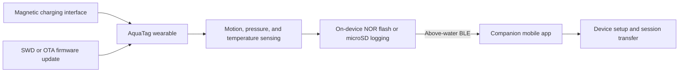

# AquaTag

Open-source wearable platform enabling flexible sensor placement for aquatic sensing.

> **Release status:** repository scaffold. Hardware design files, firmware, companion software, and fabrication documentation will be added as they are prepared for release.

## Overview

AquaTag is a compact aquatic sensing platform for human swimming research. A single device can be mounted on the head, wrist, or lower back and records motion, pressure, and temperature measurements. Because 2.4 GHz radio is strongly attenuated by water, AquaTag stores sessions locally and synchronizes with its companion application over Bluetooth Low Energy (BLE) when the device is above water.

## System at a glance

| Area | Paper prototype |
| --- | --- |
| Placements | Head, wrist, and lower back |
| Motion sensing | Bosch BMI270 6-axis IMU, recorded at 100 Hz |
| Environmental sensing | TE Connectivity MS5540 pressure and temperature sensor |
| Compute and radio | Nordic nRF52832 with BLE |
| Storage | W25Q128 NOR flash and microSD support |
| Battery | 110 mAh rechargeable Li-ion |
| Measured runtime | Up to 4.4 h offline logging or 7.8 h non-submerged BLE streaming in the tested configuration |
| Fabrication | 3D-printed enclosure with an epoxy-potting workflow |
| Prototype cost | Approximately USD 40.57 using the paper's retail BOM |
| Pressure test | Operated for 30 min at each test stage up to 20 psi, equivalent to approximately 14.06 m hydrostatic depth |

These figures characterize the prototypes and test conditions reported in the manuscript. They are not product specifications, safety certification, or guarantees for independently fabricated devices.

## How it works



BLE supports configuration, device status, and session transfer when radio conditions permit. Continuous underwater BLE streaming is not a design claim.

## Repository layout

```text
AquaTag/
├── hardware/
│   ├── electronics/        # Schematics, PCB layout, BOM, and manufacturing files
│   ├── mechanical/         # Enclosure, clip, and mounting CAD/print files
│   └── fabrication/        # Assembly, potting, charging, and test procedures
├── firmware/               # nRF52832 firmware and device protocol
├── software/
│   ├── annotation-tool/    # Synchronized video and sensor review interface
│   └── mobile-app/         # React Native companion application
├── examples/               # Hardware, firmware, and application examples
├── docs/                   # Architecture, media, and release documentation
└── paper/                  # Citation and publication links
```

Each folder contains a README describing its intended contents and release requirements.

## Available software

The optimized [AquaTag annotation tool](software/annotation-tool/) is available now. It provides synchronized video and sensor-trace review, keyboard-driven event marking, fine synchronization adjustment, and responsive plotting for long recordings. Ready-to-run macOS and Windows packages are published on the [Releases page](https://github.com/shawnljn/AquaTag/releases).

## Planned release

- PCB source, schematic, BOM, Gerbers, and assembly outputs
- Enclosure and mounting source CAD plus printable exports
- Step-by-step assembly and epoxy-potting instructions
- nRF52832 firmware, BLE protocol, and sensor-log specification
- React Native companion application
- Hardware bring-up, programming, and application examples

See the [release checklist](docs/release-checklist.md) before making a release.

## Safety and use limitations

AquaTag is a research prototype, not certified personal protective equipment, a medical device, or a dive computer.

- Independently fabricated devices must be inspected and pressure-tested before human use.
- Never charge the device while wet. Rinse exposed charging contacts with fresh water after pool or salt-water use, remove residue, and let them dry completely before charging.
- The reported pressure test used a controlled benchtop setup and does not establish a commercial depth rating or long-term service-life rating.
- The current study evaluates recreational-to-proficient adult swimmers in a lane-controlled 25 m pool. It does not validate use by children, beginning swimmers, clinical populations, or in collision-prone/shared-lane conditions.

Read the fabrication and testing documentation in `hardware/fabrication/` before deploying hardware.

## Paper

**AquaTag: An Open-Source Wearable Platform Enabling Flexible Sensor Placement for Aquatic Sensing**

Publication venue, author list, DOI, PDF, and BibTeX will be added after the paper metadata is finalized. See [`paper/README.md`](paper/README.md) for the citation placeholder.

## Contributing

The repository is being prepared for its first source release. After the initial upload, issues and pull requests will be welcome. See [CONTRIBUTING.md](CONTRIBUTING.md) for file-placement and safety guidance.

## License

A license has not yet been selected. Until license files are added, no permission is granted to copy, modify, or redistribute the contents. The project may use separate licenses for source code, hardware designs, and documentation; these will be stated explicitly before release.
